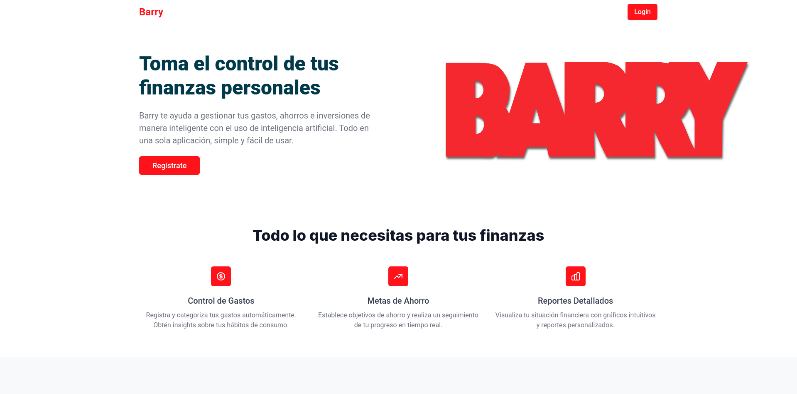
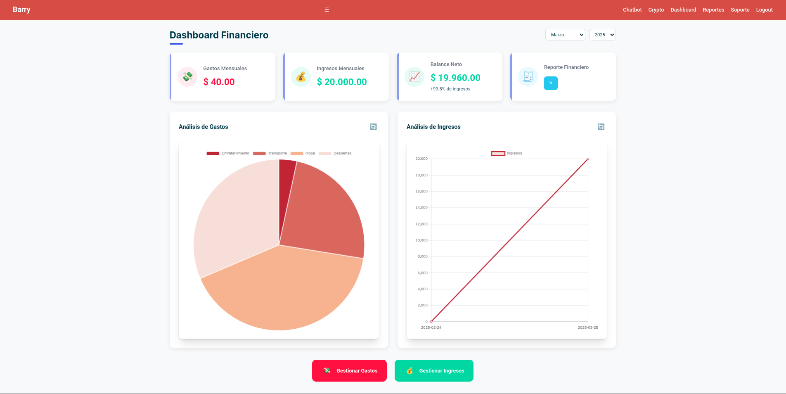
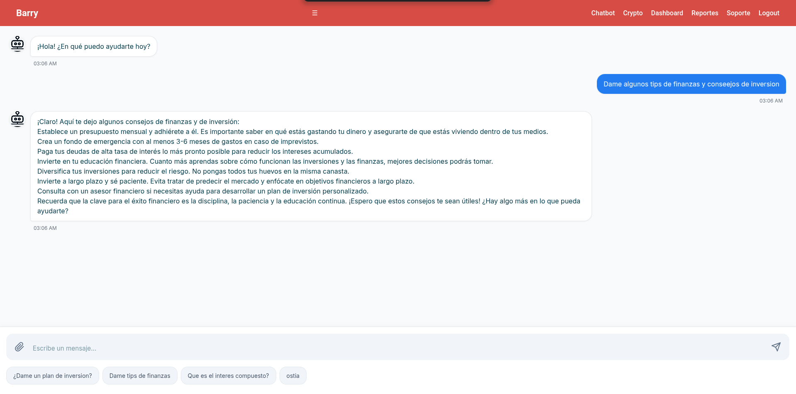

# Barry - Finance API

Barry is a finance management API that allows users to track expenses, register incomes, generate reports, and visualize financial data through charts. It also integrates with OpenAI's ChatGPT API to answer finance-related questions.

## Tech Stack

- **Backend:** Express.js
- **Frontend:** Vue.js
- **Database:** MySQL
- **Containerization:** Docker

## Features

- Register expenses and incomes
- View financial charts and reports
- AI-powered finance assistant (ChatGPT API integration)
- Generate financial reports of all transactions
- Crypto Tracking
- Support Tickets System

## Prerequisites

- Docker installed on your system
- Set up environment variables using `.env.example`

## Installation and Setup

1. Clone the repository:

   ```bash
   git clone https://github.com/wonderiing/api-barry.git
   cd barry-api
   ```

2. Copy `.env.example` to `.env` and configure the required environment variables:

   ```bash
   cp .env.example .env
   ```

3. Start the application using Docker Compose:

   ```bash
   docker-compose -f docker-compose-dev.yml up --build
   ```

4. The API should now be running at:

   ```
   http://localhost:8000
   ```

## API Endpoints


### Categories
- `GET POST PUT DELETE /api/category` - Get all categories

### Incomes
- `GET POST PUT DELETE /api/incomes` - Get all incomes

### Expenses
- `GET POST PUT DELETE /api/expenses` - Get all expenses

### AI Assistant
- `POST /api/chatgpt` - Interact with ChatGPT for finance advice


### Authentication
- `POST /api/auth/register` - Register a new user
- `POST /api/auth/login` - Login and receive a token
- `POST /googleAuth` - Google Authentication

### Crypto Tracking
- `POST /api/crypto` - Get crypto data

### Reports
- `POST /reportes` - Generate financial reports

### Email
- `POST /api/send-mail` - Send financial reports via email
## Frontend Preview

Here are some UI screenshots from the Barry frontend:

### Landing


### Dashboard


### Chatbot


## Contributing

Contributions are welcome! Feel free to submit a pull request or open an issue.

## License

This project is licensed under the MIT License.
